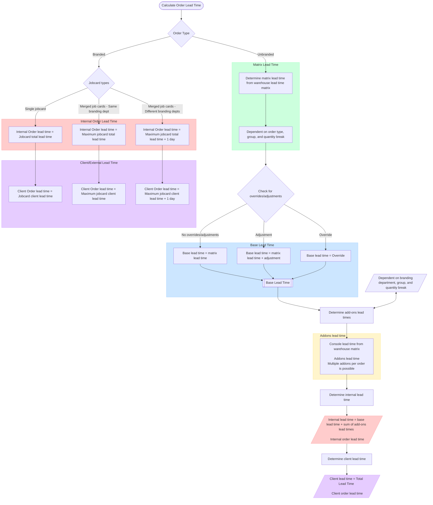
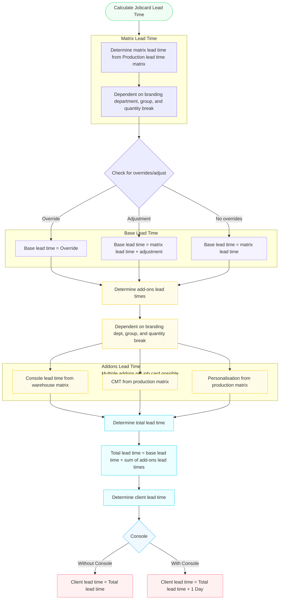

# Calculation Model & Engine

**Total Lead Time = Base Lead Time + Sum of all Add-On Lead Times**

1. If there is an Override lead time then that takes preference over Add-On and Adjustment times.
2. If there is an Adjustment but no Override then that takes preference over Add-On time.
3. Once Lead Times are calculated then apply it to the current date. Check final date against SpecialDate table. If there is an entry then take the next working data that is not in the table and not on a weekend.

All calculations follow a step-by-step pipeline to compute jobcard and order lead times.

- **Order Type Resolution**: Orders are categorised as **Branded** (having at least one branding jobcard) or **Unbranded** (stock-only, containing zero jobcards).
- **Scenario 1: Single Jobcard Order**
  - Internal Order Lead Time = Jobcard Total Internal Lead Time
  - Client Order Lead Time = Jobcard Total Client Lead Time
- **Scenario 2: Multi-Jobcard Order (Same Branding Department)**
  - Internal Order Lead Time = max(Jobcard Total Internal Lead Time)
  - Client Order Lead Time = max(Jobcard Total Client Lead Time)
- **Scenario 3: Multi-Jobcard Order (Different Branding Departments - Merged Jobs)**
  - Internal Order Lead Time = max(Jobcard Total Internal Lead Time) + 1 Day
  - Client Order Lead Time = max(Jobcard Total Client Lead Time) + 1 Day

Logo24 service follows strict cutoff rules to meet its quick-turnaround SLA.

---

- **Rule 1 (Monday to Thursday)**: If the order is approved and paid before 17:00 on a trading day, the order is ready for collection in JHB by 17:00 the following business day. If paid after 17:00, the SLA shifts by an additional business day.
- **Rule 2 (Friday)**: If paid before 12:00, the order is ready for collection in JHB by 17:00 on the following Monday (provided it is a trading day). If paid after 12:00, weekends, or public holidays, the order is disqualified from Logo24 and reverts to regular lead times.

## Exception Rules: Branch Deliveries

Branch transfers are treated as post-production logistical constraints.

1. **Lead Time Days Mode**: Branch transit days (e.g., Durban = 2 Days) are treated as additive days.
2. **Specific Delivery Days Mode**: If transfers only occur on specific days (e.g., Nelspruit = Tuesdays & Thursdays):
   - Compute the standard production due date first.
   - If that date is not a scheduled dispatch day, adjust the final branch delivery due date forward to the next scheduled delivery day.

## Lead Time Calculations

### Calculate Order Lead Times

### Calculate Job Card Lead Times

