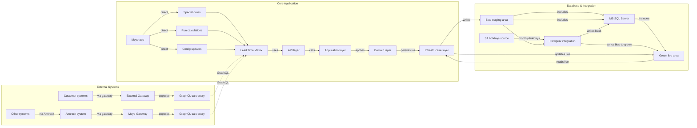
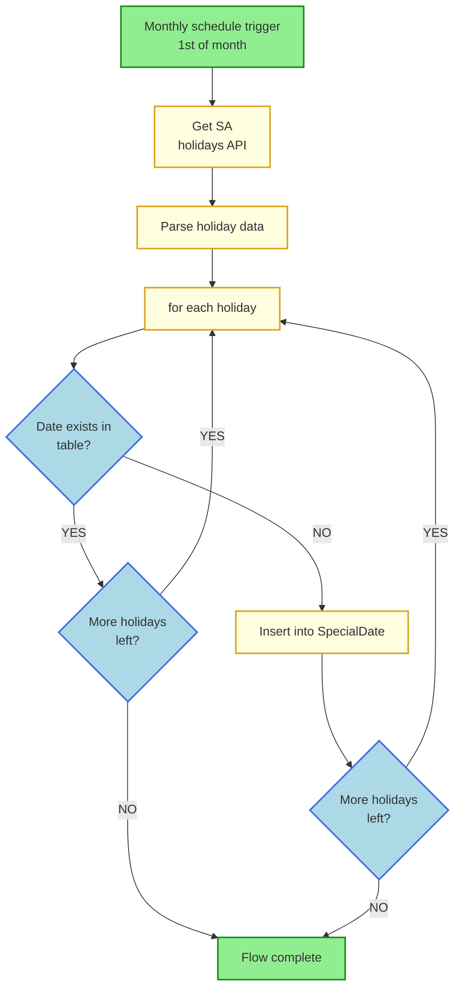
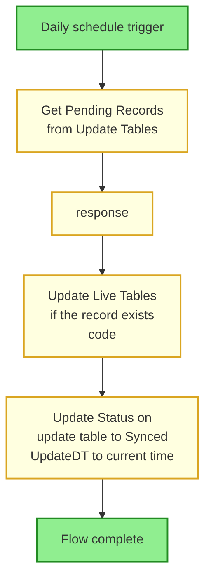

# Proposed Architecture Artefacts

## Logical Architecture Diagram



---

## Data Model

### Tables/Entities

**Live Tables (Green) & Update Tables (Blue)**

```sql
-- 1. Create Tables

CREATE TABLE BrandingDepartment (
    DepartmentId INT NOT NULL PRIMARY KEY,
    Name VARCHAR(100) NOT NULL,
    AdjustmentDays INT NOT NULL,
    AttributeName VARCHAR(100) NOT NULL,
    OverrideDays INT NOT NULL
);
GO

CREATE TABLE PrintCode (
    PrintCodeId INT NOT NULL PRIMARY KEY,
    DepartmentId INT NOT NULL,
    Name VARCHAR(100) NOT NULL,
    Description VARCHAR(MAX) NULL
);
GO

CREATE TABLE SetupCode (
    SetupCodeId INT NOT NULL PRIMARY KEY,
    PrintCodeId INT NOT NULL,
    Code VARCHAR(50) NOT NULL,
    Description VARCHAR(MAX) NULL,
    Colours INT NOT NULL,
    LowerLimit INT NOT NULL,
    UpperLimit INT NOT NULL
);
GO

CREATE TABLE InvoiceCode (
    InvoiceCodeId INT NOT NULL PRIMARY KEY,
    PrintCodeId INT NOT NULL,
    Name VARCHAR(100) NOT NULL,
    Description VARCHAR(MAX) NULL,
    AdjustmentDays INT NOT NULL,
    OverrideDays INT NOT NULL
);
GO

CREATE TABLE BrandingGroup (
    BrandingGroupId INT NOT NULL PRIMARY KEY,
    DepartmentId INT NOT NULL,
    Name VARCHAR(100) NOT NULL,
    Description VARCHAR(MAX) NULL,
    AdjustmentDays INT NOT NULL,
    OverrideDays INT NOT NULL
);
GO

CREATE TABLE QuantityBreak (
    QuantityBreakId INT NOT NULL PRIMARY KEY,
    GroupId INT NOT NULL,
    LowerLimit INT NOT NULL,
    UpperLimit INT NOT NULL,
    LeadTimeDays INT NOT NULL
);
GO

CREATE TABLE BrandingByItem (
    BrandingItemId INT NOT NULL PRIMARY KEY,
    BrandingGroupId INT NOT NULL,
    Name VARCHAR(100) NOT NULL,
    Description VARCHAR(MAX) NULL,
    AdjustmentDays INT NOT NULL,
    OverrideDays INT NOT NULL
);
GO

CREATE TABLE SpecialDateCategory (
    CategoryId INT NOT NULL PRIMARY KEY,
    Name VARCHAR(50) NOT NULL
);
GO

CREATE TABLE SpecialDate (
    SpecialDateId INT NOT NULL PRIMARY KEY,
    Date DATE NOT NULL UNIQUE,
    Name VARCHAR(100) NOT NULL,
    CategoryId INT NOT NULL
);
GO

CREATE TABLE SpecialDateImpact (
    ImpactId INT NOT NULL PRIMARY KEY,
    SpecialDateId INT NOT NULL,
    DepartmentId INT NOT NULL
);
GO

CREATE TABLE OrderType (
    OrderTypeId INT NOT NULL PRIMARY KEY,
    Name VARCHAR(100) NOT NULL,
    AdjustmentDays INT NOT NULL,
    OverrideDays INT NOT NULL
);
GO

CREATE TABLE WarehouseGroup (
    WarehouseGroupId INT NOT NULL PRIMARY KEY,
    OrderTypeId INT NOT NULL,
    Name VARCHAR(100) NOT NULL,
    Description VARCHAR(MAX) NULL,
    AdjustmentDays INT NOT NULL,
    OverrideDays INT NOT NULL
);
GO

CREATE TABLE WarehouseQuantityBreak (
    WarehouseQbid INT NOT NULL PRIMARY KEY,
    WarehouseGroupId INT NOT NULL,
    LowerLimit INT NOT NULL,
    UpperLimit INT NOT NULL,
    LeadTimeDays INT NOT NULL,
    DepartmentId INT NOT NULL
);
GO

CREATE TABLE PersonalisationRule (
    PersonalisationId INT NOT NULL PRIMARY KEY,
    DepartmentId INT NOT NULL,
    LowerLimit INT NOT NULL,
    UpperLimit INT NOT NULL,
    LeadTimeDays INT NOT NULL
);
GO
```

### Relationships

```sql
-- 2. Create Foreign Key Relationships

ALTER TABLE PrintCode
ADD CONSTRAINT FK_PrintCode_BrandingDepartment FOREIGN KEY (DepartmentId)
REFERENCES BrandingDepartment(DepartmentId);
GO

ALTER TABLE SetupCode
ADD CONSTRAINT FK_SetupCode_PrintCode FOREIGN KEY (PrintCodeId)
REFERENCES PrintCode(PrintCodeId);
GO

ALTER TABLE InvoiceCode
ADD CONSTRAINT FK_InvoiceCode_PrintCode FOREIGN KEY (PrintCodeId)
REFERENCES PrintCode(PrintCodeId);
GO

ALTER TABLE BrandingGroup
ADD CONSTRAINT FK_BrandingGroup_BrandingDepartment FOREIGN KEY (DepartmentId)
REFERENCES BrandingDepartment(DepartmentId);
GO

ALTER TABLE QuantityBreak
ADD CONSTRAINT FK_QuantityBreak_BrandingGroup FOREIGN KEY (GroupId)
REFERENCES BrandingGroup(BrandingGroupId);
GO

ALTER TABLE BrandingByItem
ADD CONSTRAINT FK_BrandingByItem_BrandingGroup FOREIGN KEY (BrandingGroupId)
REFERENCES BrandingGroup(BrandingGroupId);
GO

ALTER TABLE SpecialDate
ADD CONSTRAINT FK_SpecialDate_SpecialDateCategory FOREIGN KEY (CategoryId)
REFERENCES SpecialDateCategory(CategoryId);
GO

ALTER TABLE SpecialDateImpact
ADD CONSTRAINT FK_SpecialDateImpact_SpecialDate FOREIGN KEY (SpecialDateId)
REFERENCES SpecialDate(SpecialDateId);
GO

ALTER TABLE SpecialDateImpact
ADD CONSTRAINT FK_SpecialDateImpact_BrandingDepartment FOREIGN KEY (DepartmentId)
REFERENCES BrandingDepartment(DepartmentId);
GO

ALTER TABLE WarehouseGroup
ADD CONSTRAINT FK_WarehouseGroup_OrderType FOREIGN KEY (OrderTypeId)
REFERENCES OrderType(OrderTypeId);
GO

ALTER TABLE WarehouseQuantityBreak
ADD CONSTRAINT FK_WarehouseQuantityBreak_WarehouseGroup FOREIGN KEY (WarehouseGroupId)
REFERENCES WarehouseGroup(WarehouseGroupId);
GO

ALTER TABLE WarehouseQuantityBreak
ADD CONSTRAINT FK_WarehouseQuantityBreak_BrandingDepartment FOREIGN KEY (DepartmentId)
REFERENCES BrandingDepartment(DepartmentId);
GO

ALTER TABLE PersonalisationRule
ADD CONSTRAINT FK_PersonalisationRule_BrandingDepartment FOREIGN KEY (DepartmentId)
REFERENCES BrandingDepartment(DepartmentId);
GO
```

### Update Tables (Blue Staging Area)

Update tables parallel the live tables and include a `Status` field to track change state (e.g., "Pending", "Approved", "Synced"):

```sql
-- 3. Create Update/Staging Tables for Blue Environment

CREATE TABLE BrandingDepartmentUpdate (
    RecordId INT NOT NULL PRIMARY KEY,
    DepartmentId INT NOT NULL,
    Name VARCHAR(100) NOT NULL,
    AdjustmentDays INT NOT NULL,
    AttributeName VARCHAR(100) NOT NULL,
    OverrideDays INT NOT NULL,
    Status VARCHAR(50) NOT NULL
);
GO

CREATE TABLE SetupCodeUpdate (
    RecordId INT NOT NULL PRIMARY KEY,
    SetupCodeId INT NOT NULL,
    PrintCodeId INT NOT NULL, -- FK
    Code VARCHAR(50) NOT NULL,
    Description VARCHAR(MAX) NULL,
    Colours INT NOT NULL,
    LowerLimit INT NOT NULL,
    UpperLimit INT NOT NULL,
    Status VARCHAR(50) NOT NULL
);
GO

CREATE TABLE QuantityBreakUpdate (
    RecordId INT NOT NULL PRIMARY KEY,
    QuantityBreakId INT NOT NULL,
    GroupId INT NOT NULL, -- FK
    LowerLimit INT NOT NULL,
    UpperLimit INT NOT NULL,
    LeadTimeDays INT NOT NULL,
    Status VARCHAR(50) NOT NULL
);
GO

CREATE TABLE PrintCodeUpdate (
    RecordId INT NOT NULL PRIMARY KEY,
    PrintCodeId INT NOT NULL,
    DepartmentId INT NOT NULL, -- FK
    Name VARCHAR(100) NOT NULL,
    Description VARCHAR(MAX) NULL,
    Status VARCHAR(50) NOT NULL
);
GO

CREATE TABLE InvoiceCodeUpdate (
    RecordId INT NOT NULL PRIMARY KEY,
    InvoiceCodeId INT NOT NULL,
    PrintCodeId INT NOT NULL, -- FK
    Name VARCHAR(100) NOT NULL,
    Description VARCHAR(MAX) NULL,
    AdjustmentDays INT NOT NULL,
    OverrideDays INT NOT NULL,
    Status VARCHAR(50) NOT NULL
);
GO

CREATE TABLE BrandingGroupUpdate (
    RecordId INT NOT NULL PRIMARY KEY,
    BrandingGroupId INT NOT NULL,
    DepartmentId INT NOT NULL, -- FK
    Name VARCHAR(100) NOT NULL,
    Description VARCHAR(MAX) NULL,
    AdjustmentDays INT NOT NULL,
    OverrideDays INT NOT NULL,
    Status VARCHAR(50) NOT NULL
);
GO

CREATE TABLE BrandingByItemUpdate (
    RecordId INT NOT NULL PRIMARY KEY,
    BrandingItemId INT NOT NULL,
    BrandingGroupId INT NOT NULL, -- FK
    Name VARCHAR(100) NOT NULL,
    Description VARCHAR(MAX) NULL,
    AdjustmentDays INT NOT NULL,
    OverrideDays INT NOT NULL,
    Status VARCHAR(50) NOT NULL
);
GO
```

### Data Model Behavior & Governance

When a Lead Time is updated for production departments, the changes get staged in an "Updates" area first. Flowgear will process these updates daily at night and move them to the live tables. These are call "Green" for live calculations and "Blue" for lead times that have been saved but are not live yet.

Internal API calls to the GraphQL query can be specified to show the calculation based on live (green) or staged (blue) times so that we can effectively manage and show the current calculation verses what will be effective from the following day.

External API calls will not have access to the "blue" calculations that are staged.

**The only time records will be inserted or updated on the live tables are:**

- Warehouse lead times are updated immediately.
- Production lead times that do not exist in the live tables yet. The insert is immediate. Updates are staged.

## API Contracts

- Single endpoint to get the calculation result from a query - other endpoints already exist

### Calculation Query

#### GraphQL SLA Calculation

**Purpose**: Return the computed SLA due date for an order/job context, excluding weekends/public holidays and applying overrides/adjustments.

**Instances**:
- **Internal GraphQL** (authenticated, ops/admin use)
- **External GraphQL** (public/partner-facing, safe subset)

**Internal Query Flags**:
- `useStaged: boolean` - If true, calculate with staged (blue) lead times; if false, use live (green) lead times. Default: false (live)
- `includeBreakdown: boolean` - If true, return a breakdown of components contributing to the final SLA date (base, add-ons, adjustments, special-date shifts). Default: false

**Inputs (both instances)**: orderId or a calculation input object (orderType, brandingDepartments, approvalPaidTimestamps, branchDeliveryMode, etc.)
- Based on input we can return the lead time in days or we could give an actual date taking into account holidays, weekends etc. We can only calculate the actual date if we have the action date (Date order is paid and approved) as an input.

**Response (external)**: 
- `slaDate` (ISO-8601)
- `leadTime` (days)
- `mode` ('live' | 'staged' inferred server-side)

**Response (internal)**:
- `slaDate`, `mode`, and when `includeBreakdown=true`:
  - `breakdown{ baseDays, addOns[{ code, days }], adjustmentDays, overrideApplied, calendarShifts[{ date, reason }], finalComputationPath }`

#### Internal Instance Query

```graphql
query productionLeadTime(
  $orderId: ID,
  $input: ProductionLeadTimeInput,
  $useStaged: Boolean = false,
  $includeBreakdown: Boolean = false
) {
  productionLeadTime(
    orderId: $orderId,
    input: $input,
    useStaged: $useStaged
  ) {
    slaDate
    leadTime
    mode
    breakdown @include(if: $includeBreakdown) {
      baseDays
      addOns { code days }
      adjustmentDays
      overrideApplied
      calendarShifts { date reason }
      finalComputationPath
    }
  }
}
```

#### External Instance Query

```graphql
query productionLeadTime($orderId: ID, $input: ProductionLeadTimeInput) {
  productionLeadTime(orderId: $orderId, input: $input) {
    slaDate
    leadTime
    mode
  }
}
```

---

## Flowgear Date Updates

Flowgear orchestrates the monthly automation pipeline to fetch South African public holidays and synchronize them into the SpecialDate table.



**Process Flow**:

1. **Monthly Schedule Trigger** (1st of month) - Initiates the holiday synchronization process
2. **Get SA Holidays API** - Calls external API to retrieve published South African public holidays
3. **Parse Holiday Data** - Processes the API response to extract holiday information
4. **For Each Holiday** - Iterates through each holiday date
5. **Date Exists Check** - Validates if holiday date already exists in SpecialDate table
   - **NO**: Insert new holiday into SpecialDate table
   - **YES**: Skip (duplicate and conflict protection)
6. **More Holidays Left?** - Continues loop until all holidays processed
7. **Flow Complete** - Process finishes

### Data Source: Africa - OpenHolidays API

The data will be retrieved from [Africa - OpenHolidays API](https://www.openholidaysapi.com/).

**API Request**:

We will be retrieving data for the current + following year using the following GET request:

```
https://openholidaysapi.org/PublicHolidays?countryIsoCode=ZA&validFrom=2026-01-01&validTo=2027-12-31
```

### API Response Format

**Success Response** (HTTP 200):

```json
[
  {
    "id": "c07e4d86-d086-4a40-9893-2f62e8e61918",
    "startDate": "2026-01-01",
    "endDate": "2026-01-01",
    "type": "Public",
    "name": [
      {
        "language": "EN",
        "text": "New Year's Day"
      },
      {
        "language": "DE",
        "text": "Neujahrstag"
      }
    ],
    "regionalScope": "National",
    "temporalScope": "FullDay",
    "nationwide": true
  },
  {
    "id": "486a5e8a-29dd-4824-bb12-0e0ee3cbc53c",
    "startDate": "2026-03-21",
    "endDate": "2026-03-21",
    "type": "Public",
    "name": [
      {
        "language": "EN",
        "text": "Human Rights Day"
      },
      {
        "language": "DE",
        "text": "Tag der Menschenrechte"
      }
    ],
    "regionalScope": "National",
    "temporalScope": "FullDay",
    "nationwide": true
  }
]
```

**Error Response** (HTTP error code, e.g., 400):

```json
{
  "type": "https://tools.ietf.org/html/rfc9110#section-15.5.1",
  "title": "One or more validation errors occurred.",
  "status": 400,
  "errors": {
    "validTo": [
      "The validTo field is required."
    ],
    "validFrom": [
      "The validFrom field is required."
    ]
  },
  "traceId": "00-03978144fb257e2f8bbda58c2413b555-fb653259a43aab7d-00"
}
```

### Implementation Steps

1. **Retrieve data from the API** - Call OpenHolidays API with current + following year date range
2. **Parse the data returned from the API** - Deserialize JSON response and extract holiday information
3. **Update SQL database** - Insert new holidays into SpecialDate table (with conflict protection)

### Error Handling

If the flow fails at any step (API call, parsing, database update), a notification must be sent to the Architect/Flowgear team for investigation. Email notifications are acceptable.

**Failure Scenarios**:
- API returns HTTP error code
- API response is malformed or unparseable
- Database insert fails
- Network connectivity issues

---

## Flowgear Sync Updates

As described in the BRD (Business Requirements Document):

**Warehouse updates to lead times will be updated immediately.**

**Production lead times will be updated via Flowgear on a daily schedule.**

Flowgear will reference records in the update tables that are in "NEW" state and update the corresponding records in the live tables. Once done Flowgear will update the date time field to the current time and the Status field to "SYNCED".

Records will not be removed from the update tables as they will be referenced for audit purposes and future modules/processes.

### Daily Sync Workflow



**Process Flow**:

1. **Daily Schedule Trigger** - Initiates the daily synchronization process
2. **Get Pending Records from Update Tables** - Queries update tables for records in "NEW" state
3. **API Response** - Receives the list of pending records
4. **Update Live Tables** - For each pending record, updates the corresponding live table record (if it exists)
5. **Update Status to "SYNCED"** - Updates the Status field to "SYNCED" and the UpdateDT field to the current timestamp in the update table
6. **Flow Complete** - Daily sync process finishes

### Update States & Lifecycle

- **NEW** - Record has been added to the update table, pending synchronization
- **SYNCED** - Record has been successfully synchronized to the live table

### Audit Trail

All records in the update tables are retained permanently for:
- Audit trail purposes
- Historical tracking of configuration changes
- Reference by future modules and processes
- Compliance and traceability requirements

